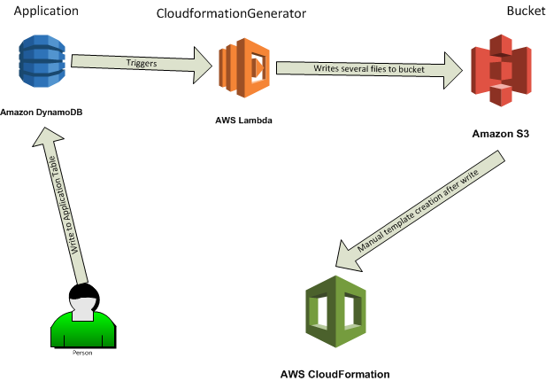

# Introduction
This initializes and deploys the CloudformationGenerator function and triggers. It builds a Cloudformation template from a DynamoDB table. The purpose is to abstract as much Cloudformation away from developers to worrry about what they only need while adhering to strict security principles. Examples of what is minimally needed is provided in the test_input folder. Properties can be added for greater customization. This builds a dependency graph so developers do not need to worry about what is deployed when.

# Getting Started
* WARNING: Since I am a lonely developer I cannot test the full installation because I do not have IAM access. Please notify me with any issues, concerns, or questions.
* Change parameters in the init.sh script for the create-stack command on line 1. Choose a cloudformation bucket name (e.g. at KAES we use kaes-cloudformation-dev) then choose your security groups and subnet ids to run lambdas in (only when you specify the lambda needs VPC access)
* Change the default.ini file in the cloudformation-generator folder for wanted defaults. These apply to all newly created items for your organization. Properties can be overriden at runtime.

# Requirements
* Python 2.7
* Virtualenv (`pip install virtualenv`)
* [AWS CLI](http://docs.aws.amazon.com/cli/latest/userguide/installing.html)

# Build and Deploy
* Run `bash init.sh` to build environment and deploy function with variables on first run
* All subsequent builds only needs to run the `bash deploy.sh` file to update the code

# TODO
* Add more documentation
* Add every AWS service